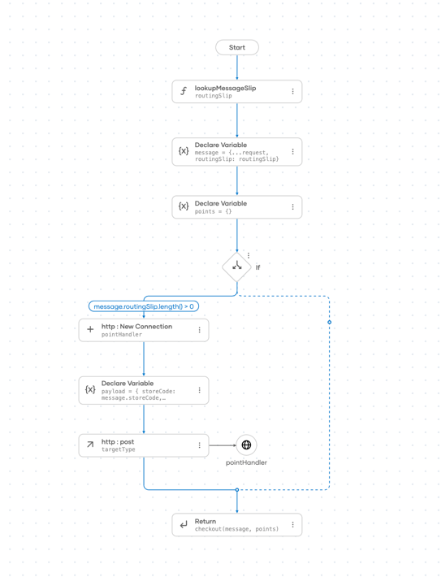

## Integration with Routing Slip Pattern Using WSO2 Integrator:BI

### Overview

The **Routing Slip** route the message to the next component according to the sequence of processing steps specified in a routing slip.
This integration is built using **WSO2 Integrator:BI** to showcase the ease of implementing such patterns within a low-code integration environment.

For more detailed information on the **Routing Slip** pattern, visit the [Routing Slip documentation](https://www.enterpriseintegrationpatterns.com/patterns/messaging/RoutingTable.html).

## Design View

The **Design View** visualizes the overall system structure.


## Integration Flow



## Sequence Diagram


## Steps to Open with WSO2 Integrator:BI

Follow these steps to open the project and start working with the **Routing Slip** integration using **WSO2 Integrator:BI** in **VS Code**:

1. Clone the repository to your local machine by running the following command.
   ```bash
   git clone https://github.com/wso2/integration-samples.git
   ```
2. Open VS Code.
3. Once VS Code is opened, go to `File > Open Folder...`.
4. Navigate to the directory where you cloned the repository.
5. Select the project folder and open it.
